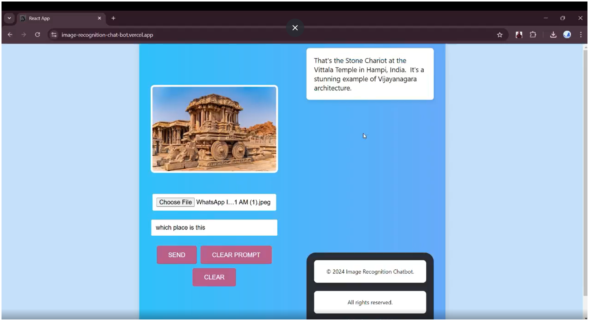

# AI Image Recognition Chatbot
### Home Page



An AI-powered Image Recognition Chatbot built with **React**, **Google Gemini API**, and **Cloudinary**. Upload an image and receive an AI-generated description, detected objects, and scene analysis in seconds.

---

##  Features

-  Upload images
-  AI-powered image recognition
-  Chatbot-style interface
-  Fast response using Gemini AI
-  Cloudinary image storage
-  Responsive design

---

##  Tech Stack

- React.js
- Axios
- CSS
- Google Gemini API
- Cloudinary

---

##  Backend Repository

Backend :  https://github.com/Pavan-Kumar-2095/Image-Recognition-ChatBot-backend


LinkedIn Post : https://www.linkedin.com/feed/update/urn:li:activity:7269224167659458560/

---

## ⚙️ Installation

Clone the repository

```bash
git clone https://github.com/Pavan-Kumar-2095/Image-Recognition-ChatBot-frontend.git
```

Go to the project folder

```bash
cd Image-Recognition-ChatBot-frontend
```

Install dependencies

```bash
npm install
```

Start the application

```bash
npm start
```

---

